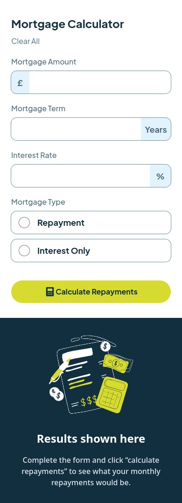
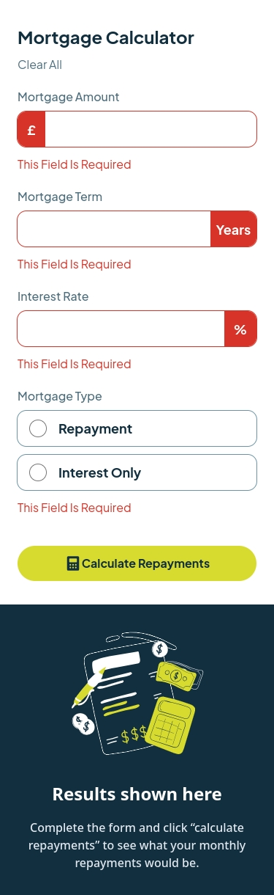
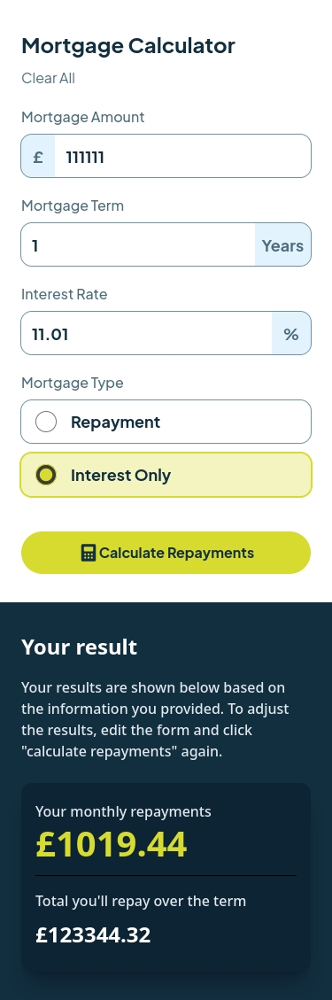
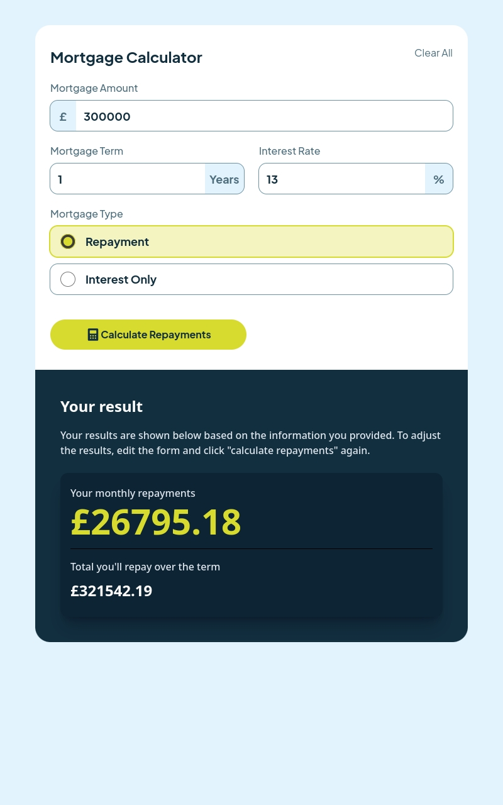
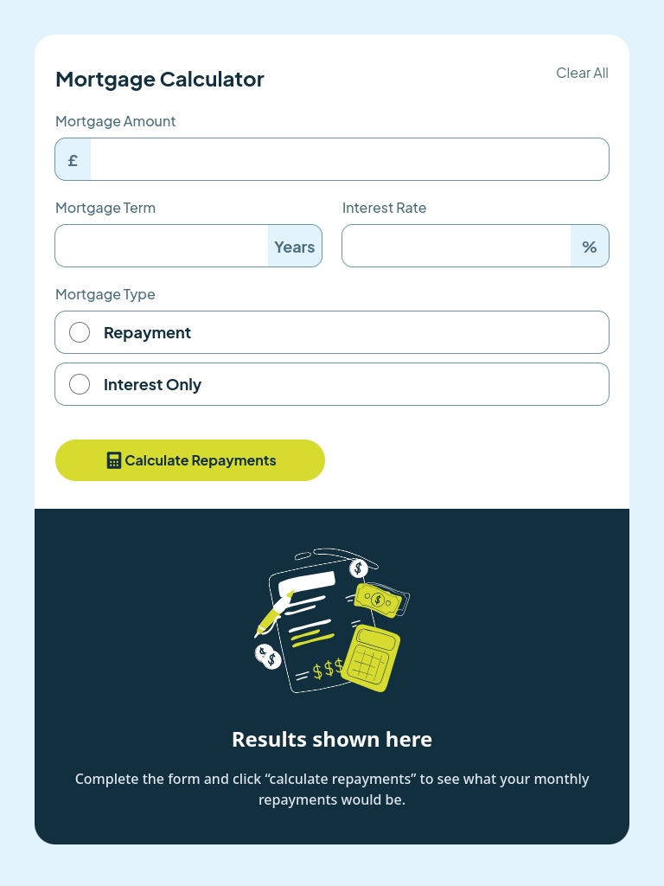
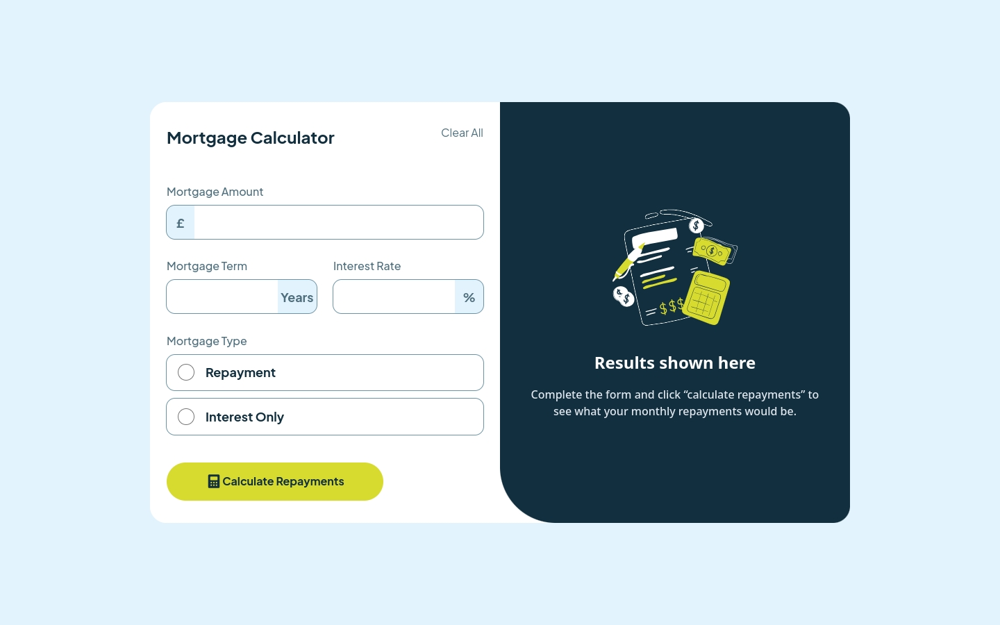
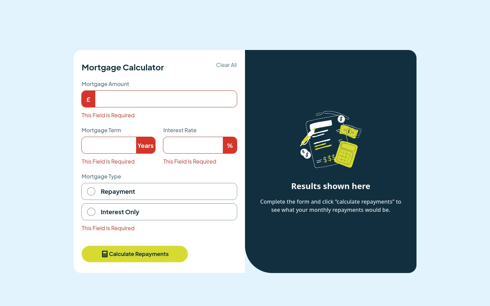

# Frontend Mentor - Mortgage repayment calculator solution

This is a solution to the [Mortgage repayment calculator challenge on Frontend Mentor](https://www.frontendmentor.io/challenges/mortgage-repayment-calculator-Galx1LXK73). Frontend Mentor challenges help you improve your coding skills by building realistic projects. 

## Table of contents

- [Overview](#overview)
  - [The challenge](#the-challenge)
  - [Screenshot](#screenshot)
  - [Links](#links)
- [My process](#my-process)
  - [Built with](#built-with)
  - [What I learned](#what-i-learned)
  - [Continued development](#continued-development)
- [Author](#author)

## Overview

### The challenge

Users should be able to:

- Input mortgage information and see monthly repayment and total repayment amounts after submitting the form
- See form validation messages if any field is incomplete
- Complete the form only using their keyboard
- View the optimal layout for the interface depending on their device's screen size
- See hover and focus states for all interactive elements on the page

### Screenshot









### Links

- Solution URL: [Add solution URL here](https://www.frontendmentor.io/solutions/vite-tailwindcss-react-accessibility-mobile-firts-swlMIib2mS)
- Live Site URL: [Add live site URL here](https://mortgage-repayment-calculator-roan.vercel.app/)

## My process

### Built with

- Semantic HTML5 markup
- [React](https://reactjs.org/) 19 - JS library
- [Vite](https://vite.dev/) - Build tool
- [Tailwind CSS](https://tailwindcss.com/) 4 - CSS framework
- React Context + useReducer for state management

### What I learned

This project helped me practice several key concepts:

- **React Context with useReducer**: Managing complex form state using React Context and useReducer pattern for predictable state updates
- **Form Validation**: Implementing client-side validation with custom validation logic
- **Tailwind CSS v4**: Using the latest version of Tailwind CSS with the Vite plugin
- **Accessibility**: Ensuring form elements are accessible with proper ARIA attributes and keyboard navigation

```jsx
const initialState = {
  amount: '',
  term: '',
  rate: '',
  mortgageType: '',
  errorMortgage: {},
  result: null
}
```

### Continued development

Areas I want to focus on:

- Adding unit tests with Vitest
- Implementing an error boundary
- Enhancing error handling with more descriptive messages

## Author

- Frontend Mentor - [@rf1303](https://www.frontendmentor.io/profile/rf1303)
- GitHub - [@rf1303](https://github.com/rf1303)
- Linkedin - [@Ramiro Fernandez](https://www.linkedin.com/in/ramiro-fernandez-260935125/)
